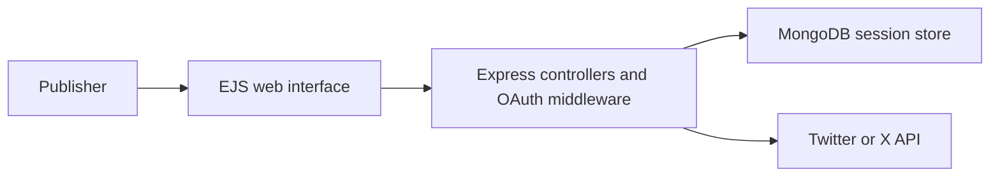
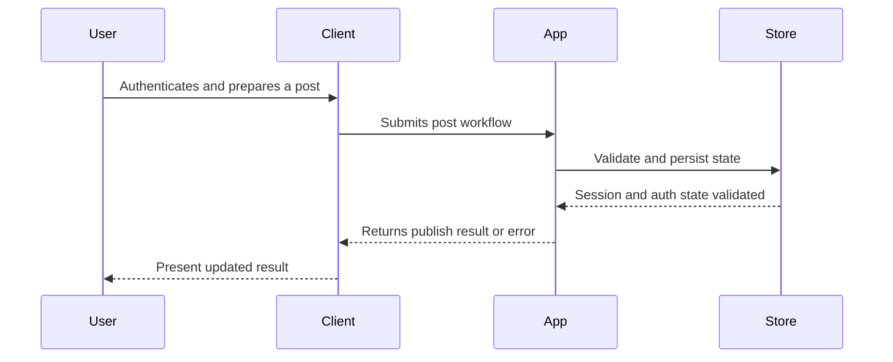

# Architecture

The application is a server-rendered Express app. Passport handles Twitter OAuth, MongoDB stores session state, and controller logic coordinates post-related workflows.

## Component View

## Key Components

- Express entry point
- Passport Twitter strategy
- MongoDB-backed session storage
- EJS views and static assets
- Twitter API integration layer

## Main Workflow

## Design Considerations

- Make user consent explicit
- Treat platform rate limits and policy changes as core product constraints
- Keep post preview and confirmation steps separate from API submission

